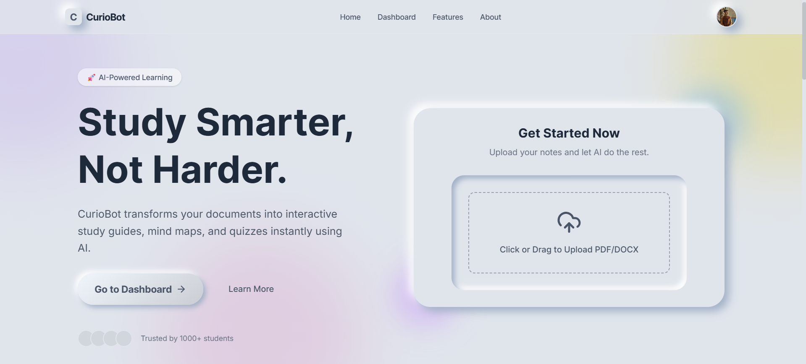
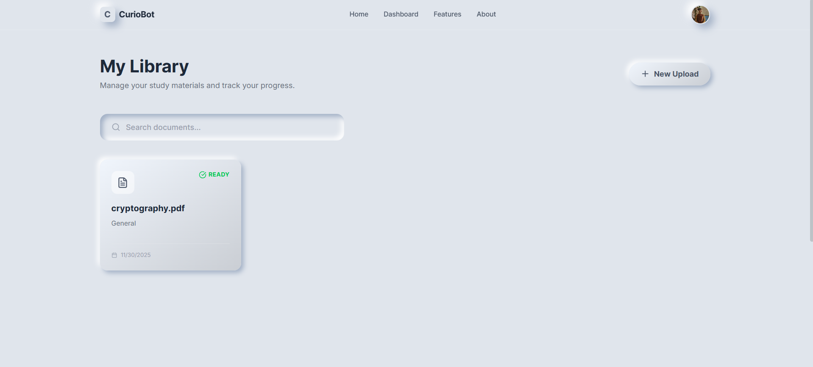
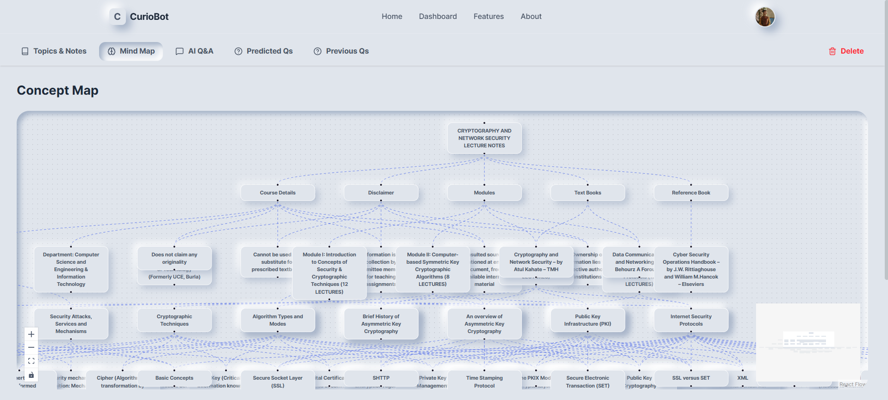
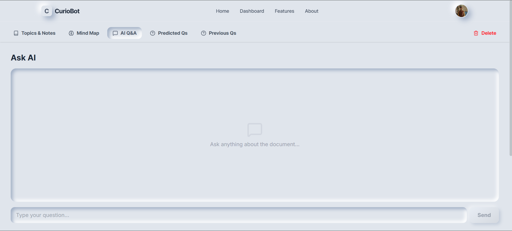
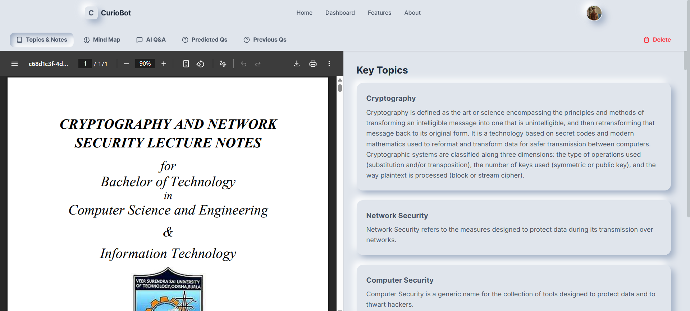
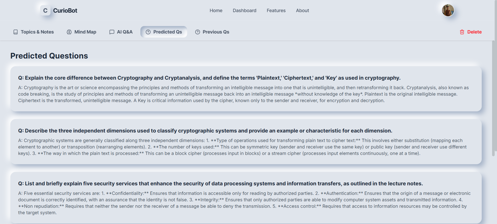

# Curiobot

Curiobot is an AI-powered study assistant that transforms PDF documents into interactive learning experiences. It generates dynamic mind maps, extracts key topics, and provides an intelligent Q&A chat interface to help students understand complex material faster.

## Visuals

### Homepage


### Dashboard


### Interactive Mind Map


### AI Q&A Interface


### Key Topics Extraction


### Predicted Questions


## Features

- **Interactive Mind Maps**: Visualizes concepts from your PDFs in a hierarchical tree structure using React Flow.
- **AI-Powered Q&A**: Chat with your documents. The system uses RAG (Retrieval-Augmented Generation) to provide accurate answers based *only* on the specific document's content.
- **Topic Extraction**: Automatically identifies and explains key topics.
- **Parallel Processing**: Optimized backend processes large PDFs quickly by running analysis and vector embedding tasks concurrently.

## Technology Stack

### Frontend
- **Framework**: Next.js 14 (App Router)
- **Language**: TypeScript
- **Styling**: Tailwind CSS
- **Visualization**: React Flow (for Mind Maps)

### Backend
- **Framework**: FastAPI (Python)
- **LLM**: Google Gemini (Flash 2.0 & Pro)
- **Vector DB**: Pinecone
- **Storage**: Google Cloud Storage (GCS)
- **Caching/Progress**: Redis
- **Orchestration**: LangGraph (for analysis workflows)

## Quick Start

### Using Docker Compose (Recommended)

The easiest way to run the entire stack (Frontend, Backend, Redis) is with Docker Compose.

```bash
docker-compose up --build
```

Access the app at `http://localhost:3000`.

### Manual Setup

Please refer to the specific README files for detailed setup instructions:

- [Backend README](./backend/README.md)
- [Frontend README](./frontend/README.md)
